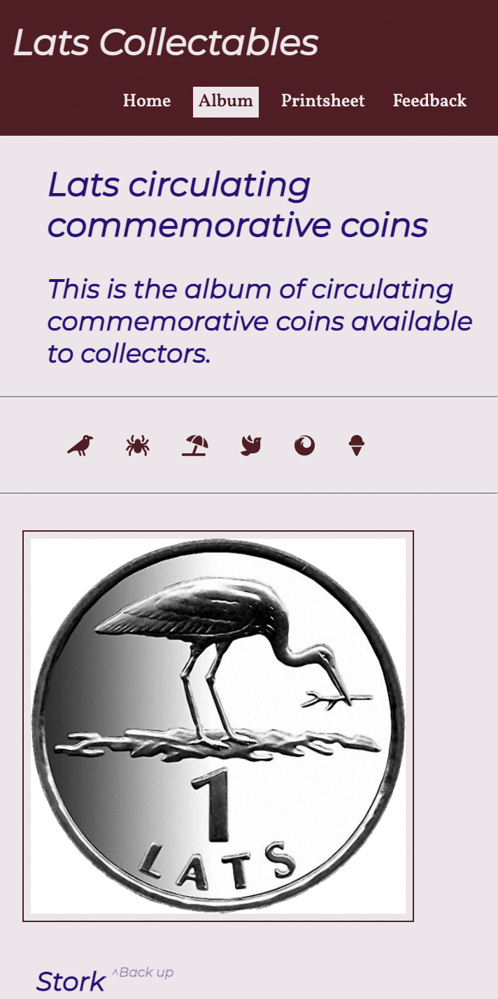
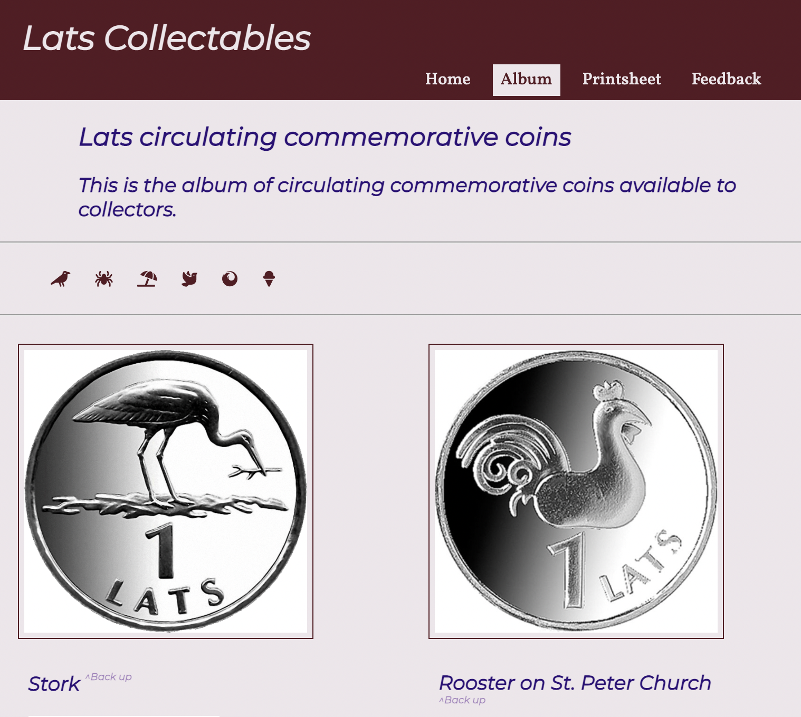

# Lats Collectables

Before Euro became the currency of Latvia there was Lats. This website is dedicated to collectable Lats coins that were in circulation in Latvia during that time.

## Features

### Existing features

#### The navigation bar

* A simple navigation bar that contains a title and links to all webpages for this project. 
* It is located at the top of the page 

#### The hero image

* A stylized image of Lats coins to.

#### A brief introduction to the site 

* Description to all pages in the site
* Working links to each of the included in the description
* A Youtube video to show What kind of Lats coins were in circulation 

#### The footer

* Contains copyright 

#### The album

* Coins are organized in articles
* Each article contains:
    * Picture of the coin
    * Table of the main information about the coin
    * Short description about the meaning of the coin
* To make the album easier to read articles change style when hovered over

#### Collectors print sheet

* A simplified, print-friendly table downloadable in PDF format.

#### Feedback 

* A form to leave feedback for improvements of the website.
* Content posted to CI formdump

#### Responsiveness

The site is created to be goodlokking on different size screens.
For example:
* Big screen

* Small screen

* Medium screen

## Testing

Site was tested using:
* W3C CSS validator
* W3C Markup validator
* Google Chrome Developers tools

## Deployment

The site was deployed on GitHub Pages

[The link to the site](https://mangabear4dn.github.io/coined-lv/)

[The link to the repo](https://github.com/mangabear4dn/coined-lv)

## Credits

* The Code Institute student template for GitPod
* W3W for to check syntax for some symbols (copyright) and available attributes for elements
* htmlcolors.com for color pallet (BUIAA)