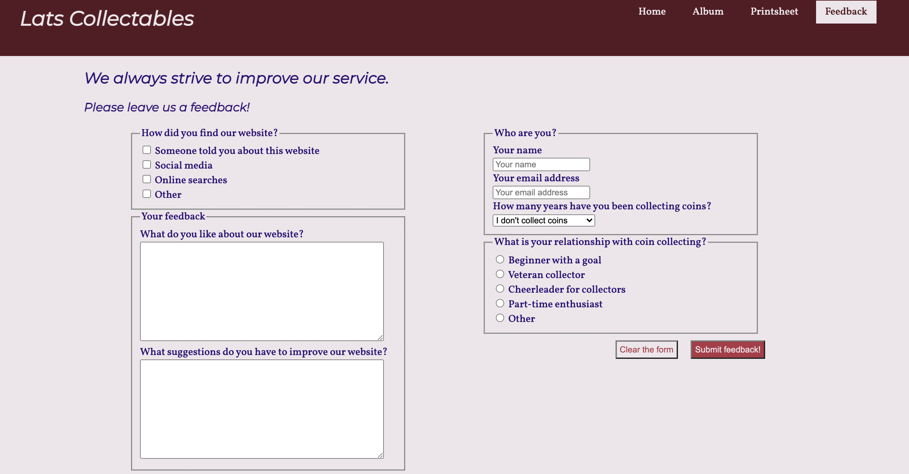
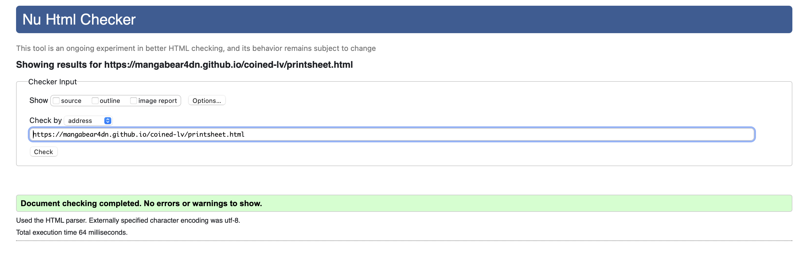

# Lats Collectables

[The link to the site](https://mangabear4dn.github.io/coined-lv/)

[Image created using Am I Responsive Design](http://ami.responsivedesign.is)

Before Euro became the currency of Latvia there was Lats. This website is dedicated to collectable Lats coins that were in circulation in Latvia during that time. Website is intended to be a short introduction to collections of Latvian coins.

## Sections of the website

### Websites business goals
* Advertise Latvian coins to already existing coin collectors
* Promote Latvian coin collecting to people interested in Latvia and Latvian culture
* Provide a well organised informational material for collectors

### Websites user goals
* For an experienced coin collector: 
    * Find information on Latvian collectable coins that exist
    * Gain necessarily tools to start collecting Latvian coins or improve already existing collection of Latvian coins
    * Share information and suggestions to help promote Latvian coin collecting

* For a beginner coin collector:
    * Gain information necessary to start collecting coins as a beginner 
    * Learn without being overwhelmed by big amounts of information.

* For a person looking for some information about Latvia:
    * Learn key information that leads to more research 
    * Gain facts without commercial bias

## UX

### Strategy

The strategy for this project was to create easy to use tools for coin collecting that could be easily added to in the future. 

Focus of the website is the collectable Lats coins that have been in circulation.

The key points when creating the product (the website) are:
* take action (to collect coins)
* learn usuful information (a road map to coin collecting)
* spend time on the website (engaging content)
* focus on coins (no distractions by trivial advertisements)
* visit again (be easy to navigate to promote as a resource when time is limited to take action)
* communicate to improve (feedback is very important)

### Scope

Website needs to be in a minimalistic style and provide various tools to look at the focus of the website:
* Navigation that is easy to use
* Introduction to each page
* Different ways to look at the coins:
    * an album - pictures and descriptions 
    * a printsheet - simple table user can print and fill out  
    * a introductory video - least effort required to learn about the topic
* Feedback form to learn about actual users and interact with them

### Structure
The website consists of 4 pages:

1. Introduction
    1. Hero image
    2. Introduction to each page on the website
    3. A video on the main topic
2. Album
    1. Article on each coin:
        1. Picture of the coin
        2. Few facts about the coin in a table
        3. Paragraph about the image on the the coin
3. Printsheet
    1. Reason for the printsheet (text)
    2. Link to download the printsheet
4. Feedback Form
    1. Fields about the user's background
    2. User's opinions of the website

Each page has a consistant main structure:
1. Header
    1. Title
    2. Navigation (with distinction of what page user is at)
2. Main section containing main content of the page
3. Footer
    1. Copyright

### Skeleton

* Header is located always at the top of the page
    * Title is visible at the top left side of the header
    * Navigation is at the top right side of the header. If the screen size is small the navigation is lower than the title.
* Footer is located at the bottom of the page or at the end of the pages content
    * Copyright symbol is visible at the center of the footer
* The main content of the page adjusts responsively to the screen

### Surface

#### Introduction

#### Album

#### Printsheet

#### Feedback

#### Features to implement in the future

* Means of collaborating with other related websites
* Integrate more than one collection of coins both as an album and a printsheet

## Testing

### User stories

* For an experienced coin collector: 
    * Album contains clear and concise information about what kind of Latvian coins are available
    * Website provide a printsheet that can be used to keep track of existing coins in total that isn't easily available on sites that focus on coins available for trade or purchase
    * There is a feedback form where a collector can share their knowledge and make suggestions to improve the Website

* For a beginner coin collector:
    * Album and printsheet provided on the website are simple but effective tools for starting a Latvian coin collection for someone who has never built a coin collection before 
    * Website focuses on provide the main points about each topic rather than giving long paragraphs and lists about each coin 

* For a person looking for some information about Latvia:
    * Websites main page provides description of all pages available on the the website and links to them as well as a simple navigation bar to help them navigate between pages while browsing 
    * The Album and printsheet pages provide only information about coins minted in general rather than biased and ever changing information on their value and availability at the moment of the search. 

### Validation

Site was tested using:
* W3C CSS validator
* W3C Markup validator
* Google Chrome Developers tools

#### Validating Index

When validating the Introduction/Index tere were 2 warnings about sections not having the necessary headings. This will be fixed in the future but priority for the time being was fixing any errors that appear in validation.
#### Validating Album

When validating the Album there were 13 warnings about sections and articles not having the necessary headings to them. The warnings were left unresolved and will be adjusted and fixed in the future but for now they are left as is. 
#### Validating Printsheet

Printsheet validated without any issues.
#### Validating Feedback form

This issue was resolved by adding a 'size' attribute to the 'select' element in question. After which the page validated without issues.

#### Validating CSS
CSS styling validated well.

There was a warning about the imported libraries that are not checked.

#### Lighthouse

When testing the websites performance with Google Developers Tools Lighthouse the results were very good. There were some parts on the website that could be improved more but at the present the scores were all above 85% in the categories of Performance, Accessibility, Best Practices and SEO both when testing for mobile devices and desktop.

## Deployment

This project was developed using GitHub as the version control technology and GitPod as the environment for day-to-day coding. Later the project was published on GitHub Pages.

1. In it’s initiation I created a repository on GitHub called 'coined-lv'. I used the CI provided template for new projects. The repository was made public.
2. For coding purposes I downloaded Google Chrome on the MacBook device that I’m using at the moment. Because the Safari browser didn't have the necessary add-ons to use GitPod.
3. I first opened the project repository in GitPod by pressing the 'Code' button available in the projects GitHub repository when viewing files. Later I accessed the GitPod development enviroment directly from GitPod workspaces.
4. When most of the work on the project was done I published the website to GitHub Pages - in project's GitHub repository settings section Pages by presing 'Save' to GitHub Pages
5. The website initially was published without the latest changes at the time being added to it (some sort of a system issue. Everything had been pushed correctly ly at the time). 
6. The fist time after the publishing that I pushed changes to git I had an issue with GitHub having changes that were not present on the local device. Since the version on my local device is the one that was the most current at the time I used 'git push --force' terminal command to resolve the issue. 
7. There were no issues with GitHub, GitPod and Github Pages after that. And the website is available online.

## Credits and inspirations
* The Code Institute student template for GitPod
* W3W for to check syntax for some symbols (copyright) and available attributes for elements
* htmlcolors.com for color pallet (BUIAA)
* [Techscrew](https://www.youtube.com/watch?v=CiEQntPYSNE) for the video used on the website
* [W3C CSS Validator](https://jigsaw.w3.org/css-validator/) when checking the CSS
* [W3C Markup Validator] (https://validator.w3.org/#validate_by_uri) when checking the HTML
* And other people and resources used with mentions at the parts in the code related to them
* Also huge thank you to both of the mentors who helped me while working on this project: Can Sucullu & Guido Cecilio.